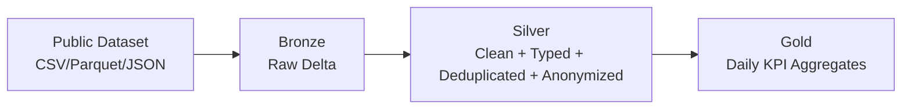

# Flagship Project: End-to-End Medallion Lakehouse

Production-style Medallion pipeline built with **PySpark + Delta Lake**.
Focus: scale, governance, and business-ready data products.

## What this project proves

- I can design and run **Bronze → Silver → Gold** with clean separation of concerns.
- I treat **data quality and governance as non-negotiable** in the pipeline logic.
- I deliver a **Gold layer focused on KPIs**, not only technical outputs.

## Architecture



## Dataset Suggestions

You can run this pipeline with:

- NYC Yellow Taxi Trip Records (recommended)
- Any Kaggle financial transaction dataset with millions of rows

## Project Structure

```
flagship-medallion-lakehouse/
├─ data/
│  ├─ raw/
│  ├─ bronze/
│  ├─ silver/
│  └─ gold/
├─ reports/
├─ src/
│  ├─ medallion_pipeline.py
│  └─ privacy.py
├─ requirements.txt
└─ README.md
```

## Setup

```bash
python -m venv .venv
.venv\\Scripts\\activate
pip install -r requirements.txt
```

## Run

```bash
python src/medallion_pipeline.py \
  --input-path "C:/Users/srmat/Documents/Projetos git/flagship-medallion-lakehouse/data/raw/yellow_tripdata_2024-01.parquet" \
  --input-format parquet \
  --sensitive-columns "email,cpf,phone,card_number"
```

Tip: place your downloaded public dataset file inside `data/raw/` and keep the same command structure.

## Governance (LGPD)

Sensitive fields are anonymized in `src/privacy.py` using SHA-256 + salt.

- deterministic output for analytical joins
- no raw PII in curated layers
- easier compliance discussions with Audit/Risk teams

## Gold KPIs

Gold output prioritizes decision-making metrics:

- total trips
- average trip distance
- total revenue (when `total_amount` exists)
- daily granularity (when pickup timestamp exists)

## Why this project is portfolio-relevant

- Shows end-to-end ownership: ingestion, quality, governance, and KPI delivery
- Reflects enterprise lakehouse standards used in Databricks ecosystems
- Supports technical and business conversations with the same artifact

## Operational Constraints

- Designed for high-volume processing where schema drift and null spikes are common.
- Governance is embedded in transformation code, not handled as a post-process.
- Silver and Gold outputs are structured for auditability and KPI consumption.

## Execution Evidence (Local Run)

- Run date: `2026-03-09` (Windows local environment)
- Input used for local validation: `data/raw/sample_taxi.csv`
- Transcript log: `reports/run_2026-03-09_17-53-48.log`
- Run notes: `reports/run_log.md`

Observed blocker in this machine: Spark startup fails on Windows due to missing `HADOOP_HOME/winutils`.
The transcript is preserved to document real execution and environment constraints.
