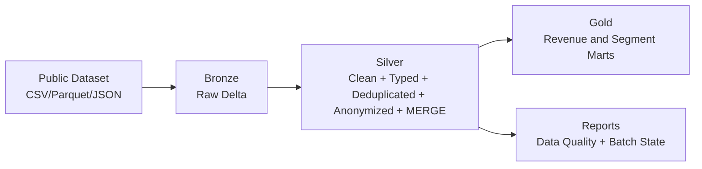

# Flagship Project: End-to-End Medallion Lakehouse

Practical Medallion pipeline built with **PySpark + Delta Lake**.
Focus: robustness under imperfect data, incremental batches, and observable quality.

## What changed in this version

- Incremental processing with batch tracking (`processed_batches.txt`).
- Idempotent behavior: same `batch_id` is skipped on rerun.
- Silver upsert with `MERGE` on `trip_id` for late-arriving updates.
- Schema evolution detection (new columns logged when they appear).
- Data quality report persisted per batch.

## Architecture



## Dataset Suggestions

You can run this pipeline with:

- NYC Yellow Taxi Trip Records (recommended)
- Any Kaggle financial transaction dataset with millions of rows

## Project Structure

```
flagship-medallion-lakehouse/
├─ data/
│  ├─ raw/
│  ├─ bronze/
│  ├─ silver/
│  └─ gold/
├─ reports/
├─ src/
│  ├─ medallion_pipeline.py
│  └─ privacy.py
├─ requirements.txt
└─ README.md
```

## Setup

```bash
python -m venv .venv
.venv\\Scripts\\activate
pip install -r requirements.txt
```

## Run

```bash
python src/medallion_pipeline.py \
  --input-path "<workspace-path>/flagship-medallion-lakehouse/data/raw/sample_taxi.csv" \
  --input-format csv \
  --batch-id taxi_2024_01_01 \
  --sensitive-columns "email,cpf,phone,card_number"
```

If you rerun with the same `--batch-id`, the run is skipped to avoid duplicate ingestion.

Useful optional args:

```bash
--incremental-state-path reports/processed_batches.txt
--schema-state-path reports/bronze_schema_columns.txt
--quality-report-path reports/data_quality_report
```

## Governance (LGPD)

Sensitive fields are anonymized in `src/privacy.py` using SHA-256 + salt.

- deterministic output for analytical joins
- no raw PII in curated layers
- easier compliance discussions with Audit/Risk teams

## Real-world behavior simulated

- Bronze accepts schema drift (`mergeSchema=true`) instead of breaking on new columns.
- Silver enforces null filtering and deduplicates by `trip_id`.
- Silver uses `MERGE` to update existing trips when late records arrive.
- Quality metrics are written per batch (`invalid_rows_count`, `null/invalid ratio`, `duplicate_ratio`).

## Gold KPIs

Gold now writes two marts:

- `gold/revenue_by_region`
  - total trips
  - total revenue (when `total_amount` exists)
  - daily grain when pickup timestamp exists
- `gold/trips_by_customer_segment`
  - trips by segment/vendor
  - average trip distance (when available)

## Operational Constraints

- On Windows local runs, Spark may require `HADOOP_HOME`/`winutils.exe`.
- `MERGE` depends on Delta runtime compatibility.
- Quality report values are meant for trend monitoring across batches.

Study notes and lessons are documented in `LESSONS_LEARNED.md`.
